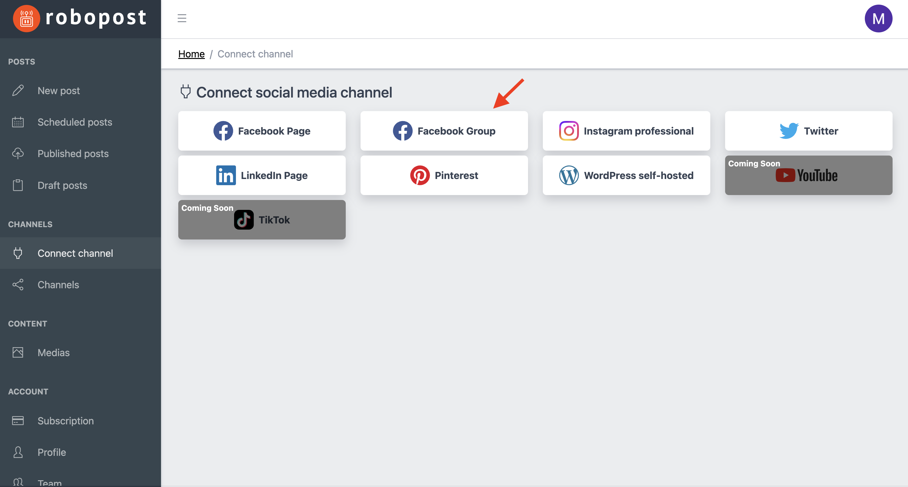

# Facebook Group

### Requirements for connecting Groups

1. **You must have admin privileges for the Facebook Group**. If you don't have it, please ask the owner of the Group to grant you the necessary permissions. (Find more at [Facebook Help Center](https://www.facebook.com/help/1686671141596230))
2. You need to **turn on two-factor authentication** for your Facebook account. (Find more at [Facebook Help Center](https://www.facebook.com/help/148233965247823))
3. An admin of the Group needs to add Robopost app to the Group. (Find more at [Facebook Help Center](https://www.facebook.com/help/www/261149227954100))

### How to connect

**Step1:** Click Facebook Group button in `CHANNELS > Connect channel`.

<figure><figcaption></figcaption></figure>

Please check what is described in the pop up. You can ignore it if you have already completed [above requirements](facebook-group.md#requirements-for-connecting-groups).

After you make sure you completed the preparation, then click `Connect`.&#x20;

**Step2:** Log in to your Facebook account.

<figure><figcaption></figcaption></figure>

**Step3:** Facebook will ask you if Robopost can have access to your Groups'/Pages' data. Please click `Continue as {Your Facebook account name}` if you agree with it.&#x20;

<figure><figcaption>
If you want to specify which Groups/Pages Robopost can access, please edit permissions from "Edit access" link.
</figcaption></figure>

**Step4:** Set all the switches of Groups you would like to connect to blue and click `Connect`.

<figure><figcaption></figcaption></figure>

After the pop up is closed, click `CHANNELS > Channels` and confirm that the Groups you selected are listed.
