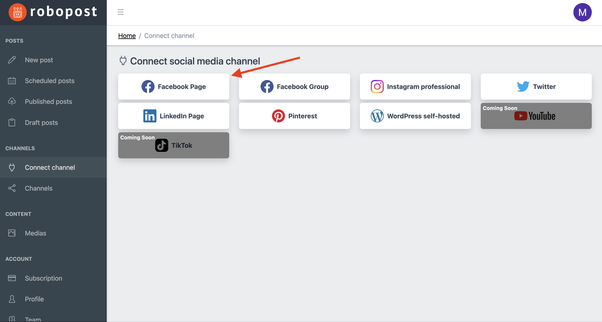
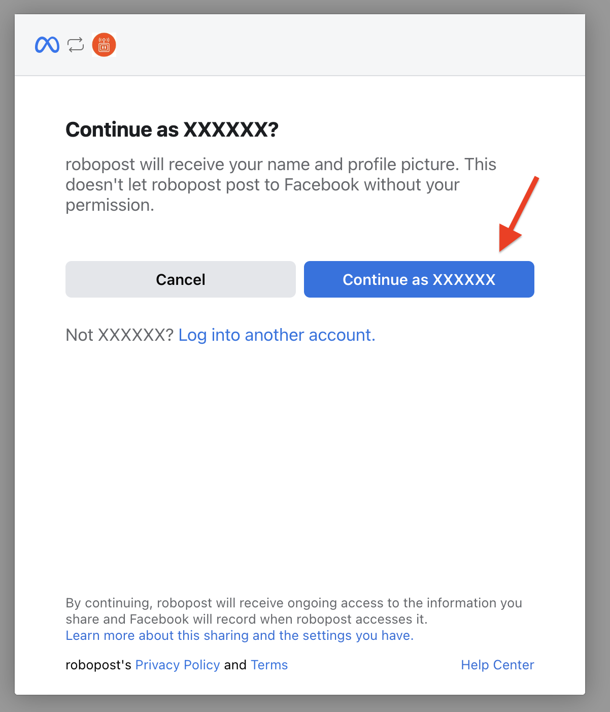

# Facebook Page

### Requirements for connecting Pages

1. **You must have an Admin or an Editor role** of classic Facebook Pages, or **Facebook access with full control or partial control** for new Pages. (Find more at [Facebook Help Center](https://www.facebook.com/help/1206330326045914))
2. You need to **turn on two-factor authentication** for your Facebook account. (Find more at [Facebook Help Center](https://www.facebook.com/help/148233965247823))

### How to connect

**Step1:** Click Facebook Page button in `CHANNELS > Connect channel`.

<figure><figcaption></figcaption></figure>

**Step2:** Log in to your Facebook account.

<figure><figcaption></figcaption></figure>

**Step3:** Click `Continue as {Your Facebook account name}`.

<figure><figcaption></figcaption></figure>

**Step4:** Select Groups and click `Next`. This is optional. If you plan to connect Facebook Group later, we recommend you to select them at this point.

<figure><figcaption></figcaption></figure>

**Step5:** Select Pages that you would like to connect, then click `Next`. Please make sure that you have the right access to those Pages.

<figure><figcaption></figcaption></figure>

**Step6:** Confirm that the following accesses are set to <mark style="background-color:blue;">YES</mark>, and click `Done`.

* Post content into groups on your behalf (Optional: Set to YES if you have chosen any Groups in the previous page)
* Create and manage content on your Page
* Read content posted on the Page
* Show a list of the Pages you manage

<figure><figcaption></figcaption></figure>

**Step7:** Now Robopost has permission to your Facebook Pages (and Groups if you have selected). Please click `OK` and wait until the browser forward you to Robopost's page.

<figure><figcaption></figcaption></figure>

**Step8:** Set all the switches of Page you would like to connect to blue and click `Connect`.

<figure><figcaption></figcaption></figure>

After the pop up is closed, click `CHANNELS > Channels` and confirm that the Pages you selected are listed.
