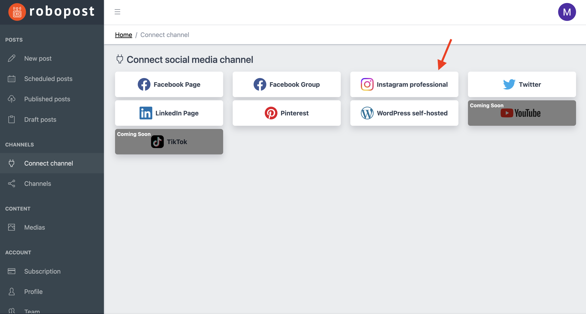

# Instagram

### Requirements for connecting Instagram profile

1. Your account's **profile type must be Business**. \*¹ You can change its profile type. (Find more at [Instagram Help Center](https://help.instagram.com/1717693135113805))
2. Your Instagram account is **linked to a Facebook Page** that you are an admin of. (Find more at [Instagram Help Center](https://help.instagram.com/570895513091465))

### How to connect

**Step1:** Click Instagram professional button in `CHANNELS > Connect channel`.

<figure><figcaption></figcaption></figure>

Please check what is described in the pop up. You can ignore it if you have already completed [above Requirements for connecting Instagram profile](instagram.md#requirements-for-connecting-instagram-profile).

After you make sure you completed the preparation, then click `Connect`.

**Step2:** Log in to your Facebook account.

<figure><figcaption></figcaption></figure>

**Step3:** Click `Continue as {Your Facebook account name}`.

<figure><figcaption></figcaption></figure>

**Step4:** Select Professional Accounts and click `Next`.

<figure><figcaption></figcaption></figure>

**Step5:** Select Pages that your Professional Accounts are linked to, then click `Next`.

<figure><figcaption></figcaption></figure>

**Step6:** Confirm that the following accesses are set to <mark style="background-color:blue;">YES</mark>, and click `Done`.

* Access profile and posts from the Instagram account connected to your Page
* Upload media and create posts for the Instagram account connected to your page
* Read content posted on the Page
* Show a list of the Pages you manage

<figure><figcaption></figcaption></figure>

**Step7:** Now Robopost has permission to your Instagram Professional Accounts. Please click OK and wait until the browser forward you to Robopost's page.

<figure><figcaption></figcaption></figure>

Step8: Set all the switches of accounts you would like to connect to blue and click `Connect`.

<figure><figcaption></figcaption></figure>

After the pop up is closed, click `CHANNELS > Channels` and confirm that the Instagram Professional Accounts you selected are listed.

### Notes

\*¹ You may be able to connect your Instagram Creator account as well, but you cannot publish from our platform due to some limitation from Instagram.
