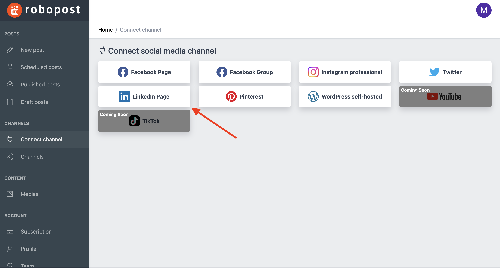

# LinkedIn

### How to connect

**Step1:** Click LinkedIn Page button in `CHANNELS > Connect channel`.

<figure><figcaption></figcaption></figure>

**Step2:** Select LinkedIn pages that you would like to connect, then click `Connect`.

<figure><figcaption></figcaption></figure>

After the pop up is closed, click `CHANNELS > Channels` and confirm that the Pages you selected are listed.
