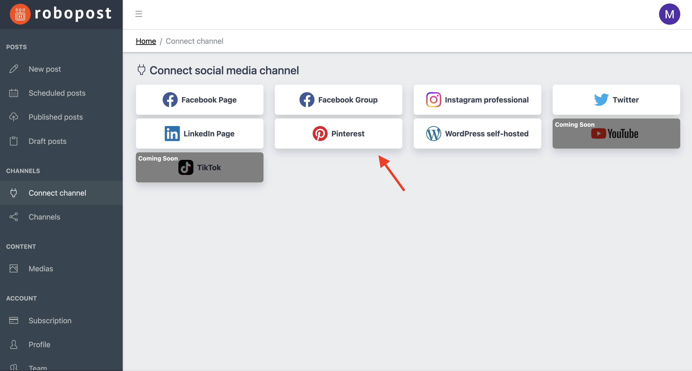

# Pinterest

### How to connect

**Step1:** Click Pinterest button in `CHANNELS > Connect channel`.

<figure><figcaption></figcaption></figure>

**Step2:** It will forward you to confirmation page of Pinterest. If you agree with what Robopost can do, please click `Give access`.

<figure><figcaption></figcaption></figure>

**Step3:** Select Pinterest boards that you would like to connect, then click `Connect`.

<figure><figcaption></figcaption></figure>

After the pop up is closed, click `CHANNELS > Channels` and confirm that the boards you selected are listed.
