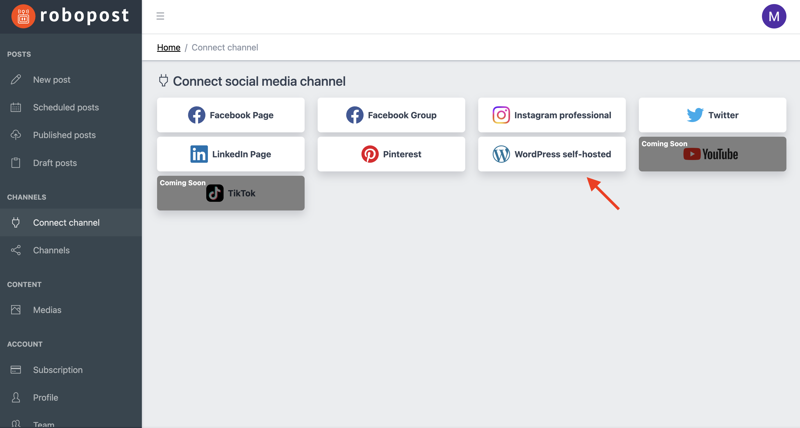

# WordPress

### How to connect

**Step1:** Click WordPress self-hosted button in `CHANNELS > Connect channel`.

<figure><figcaption></figcaption></figure>

**Step2:** Please fill out the form and click `Connect`.

* `Site URL`
* `Username`
* `Password`

<figure><figcaption></figcaption></figure>

After the pop up is closed, click `CHANNELS > Channels` and confirm that the WordPress site is listed.
