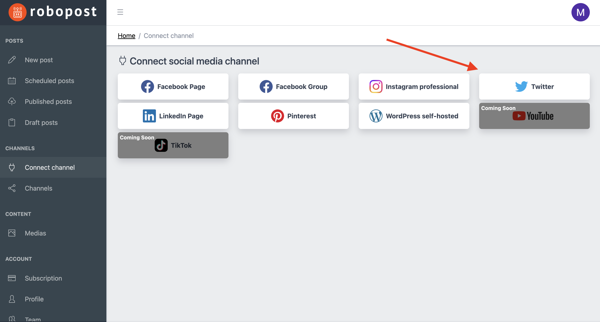

# X (former Twitter)

### How to connect

**Step1**: Click Twitter button in `CHANNELS > Connect channel`.

<figure><figcaption></figcaption></figure>

**Step2:** It will forward you to confirmation page of X (former Twitter). If you agree with what kind of your account's data Robopost can view, please click `Authorize app`.

<figure><figcaption></figcaption></figure>

After the browser forward you to Robopost's page, click `CHANNELS > Channels` and confirm that the account is listed.
